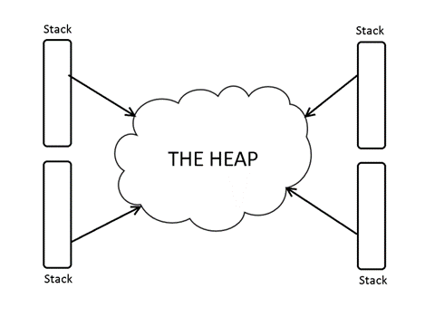
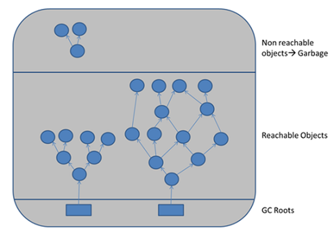
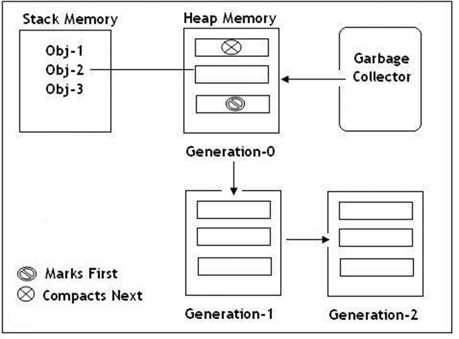

# [Adresování a správa paměti - Garbage collecting, Reference/Ukazatele, Struktura paměti programu](https://youtu.be/zhQXxuwxqek?si=Eietvsgz-LvIm1e4)

## O čem mluvit?
- Reference a ukazatele
   - co je to?
   - adresa proměnné
   - reference vs ukazatel (na adresu) vs Kopie proměnné
- Struktura paměti programu
     - Heap vs. Stack
	     - rozdíly mezi nimi, jak ukládají proměnné, k čemu jsou
- Správa paměti programu
   - garbage collector
   - manuální správa paměti   
- Garbage collector 
    - jak funguje?
    - k čemu slouží?
    - nachází se ve všech jazycích?

## Reference a Pointer
#### Reference 
- odkaz na proměnnou nebo instanci objektu na haldě
	- nemůže odkazovat na null
- abstraktní datový typ
- abstraktnější variantou ukazatele, ukazatel nemá žádnou informaci o objektu v operační paměti
- zvyšují flexibilitu
- snadnější sdílení mezi kódem
```csharp
Example exampleObject = new Example(); // exampleObject is the reference

string exampleString = "example"; // exampleString is the reference
```

#### Pointer (Ukazatel)
- odkaz na adresu (místo) proměnné
- datový typ
- může odkazovat na null
- uložení adresy v paměti počítače
- zpřístupnění dat, která jsou uložena na adrese v operační paměti
- dělí se na typy ukazatelů:
	- **Blízký ukazatel**
		- lineární adresa (offset)
		- neobsahuje identifikační číslo segmentu
	- **Vzdálený ukazatel**
		- lineární adresa (offset)
		- obsahuje identifikační číslo segmentu
- v C# se moc nepoužívá, na lowlevel je lepší C
	- v kódu musí být zabalen v unsafe
	- není zaznamenán **GC**
- v Py nejsou
- v C se deklarují pomocí *
```c
	int x = 10;
	int *uk = &x; // Ukazatel ukazuje na adresu x
	*uk = 20;     // Změna hodnoty x pomocí ukazatele
```

## Struktura paměti
#### Heap (Halda)
- je pouze jedna v celém programu
- na haldu se ukládají všechny referenční typy 
	- třída, interface, delegát, enum, objekt a **string**
- není organizovaná
- je přístupná pro všechny
	- (pokud instanci nezablokujeme modifikátorem přístupu – public, private, internal, protected)
- pokud jsou na haldě nějaká data, na které neukazuje žádná proměnná, smaže je garbage collector

#### Stack (Zásobník)
- druh paměti, který vlákna využívají pro provedení kódu
	- každé vlákno má vlastní zásobník
- je setříděný (LIFO)
- každá metoda je vlastně blok, kde jsou uložena její data, bloky jsou vrstveny na sobě takovým způsobem, že nově přidané bloky padají na starší a tím zabraňují práci s těmi předešlými, dokud nejsou vyřešeny..
- obsahuje pouze primitivní datové typy metod
	- int, float, char, bool, byte, double
- proměnné volané v metodách, se také ukládají na zásobník, jsou ale nepřístupné, a jakmile metoda skončí, smažou se
- pokud je práce s paměťovým blokem ukončena tak je i s daty smazán 
	- (není ve skutečnosti smazán, ale časem přepsán jiným blokem. Úplně stejné to funguje všude v PC)

#### Příklady
- proměné **a**,**b** jsou uloženy na heapuu, protože jsou proměnné třídy, **c** je ale proměnná metody, tudíž patří do stacku
```csharp
class example {
	int a;
	bool b;
	
	void exampleMethod()
	{
		double c;
	}
}
```



## Garbage Collector
- automatizovaná správa paměti na haldě
- uvolňuje nepoužívanou paměť
	- prochází haldu a maže objekty bez reference
- zajišťuje aby programu nedošla paměť
- může mít negativní dopad na výkon
- spouští se automaticky, ale může být také zavolán uživatelem *System.GC.Collect()*
- objekty se rozdělují na živé a mrtvé
	- živé objekty si **GC** vkládá do grafu podobnému stromu (který se ale cyklí)
		- objekt je živý do té doby, dokud se používá
		- objekty mimo strom jsou odpad odsouzeny k zániku
- rozděluje paměť v haldě do 3 kategorií **Generation 0, Generation 1 a Generation 2**



#### Generation 0
- každá proměnná začíná zde
- místo, kde se nacházejí právě vytvořené objekty (objekty s krátkou životností)
- toto místo je čištěno nejčastěji
	- je to rychlá operace
- patří sem nejčastěji dočasné proměnné (např. v metodě)
- pokud je místo plné, **GC** ho pročistí, a ty které nesmaže, jsou přesunuty do **Gen 1**

#### Generation 1
- obsahuje krátkodobé objekty a slouží jako vyrovnávací paměť mezi krátkodobé a dlouhodobé objekty
- **GC** se zde spouští oproti **Gen 0** méně častěji
- opět: pokud je místo plné, **GC** ho pročistí, a ty které nesmaže, jsou přesunuty do **Gen 2**

#### Generation 2
- obsahuje objekty s dlouhou životností
	- ty zde obvykle žijí po celý chod programu
	- jedná se například o objekty vytvořené pro statické členy nebo globální proměnné
- místo, kde **GC** zasahuje ze všech nejméně
- pokud je místo plné **GC** spustí čistku v **Gen 2** poté **Gen 1** a nakonec v **Gen 0**, pokud i tak není nikde místo, vyhodí **OutOfMemory** chybu

