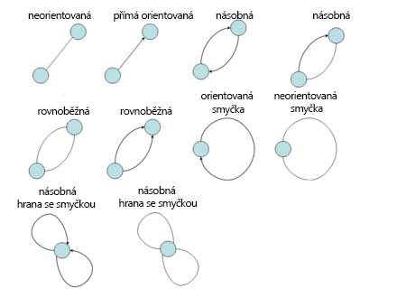
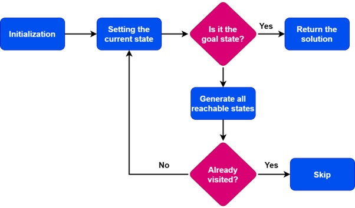
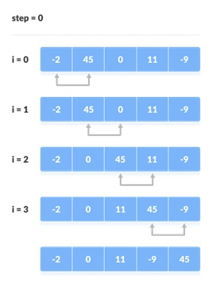
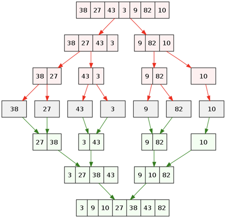
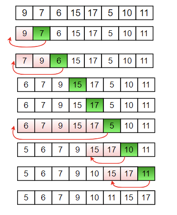
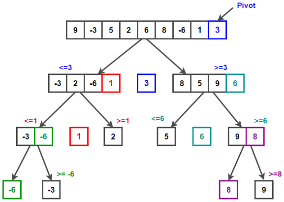

# [Algoritmizace - Grafy, Prohlédávání stavového prostoru, Řazení](https://youtu.be/vFEVHWnqLEo?si=nhnVlgqYUSbJKds1)

## O čem mluvit?
- Grafy
- Využití
- Typy
	- orientovaný / neorientovaný
	- hodnocený / neohodnocený
	- úplný / neúplný
	- cyklický / strom
- Prohledávaní stavového prostoru
	- k čemu je stavový prostor?
	- BFS / DFS
- Řazení 
	- k čemu je dobré
	- řadící algoritmy
	    - porovnání na základě časové a paměťové složitosti
## Grafy
- graf je datová strukturu popisující vztahy mezi objekty
- grafy z oblasti teorie grafů mají široké využití v mnoha oblastech, např. úlohy o dopravním spojení, logistické problémy, optimální spojení, propustnost sítě, přenos energie, komprese dat
- každý graf obsahuje:
	- Body = vrcholy grafu (uzly)
	- Linie = hrany graf
- typy hran:

*Pozor na pidimidi šipky*
## Typy Grafů
#### Orientovaný
- obsahuje hrany s definovaným směrem
	- hrany mají šipky označující směr procházení
- hrany mají počáteční a koncový vrchol
- např.: graf webové stránky, kde jsou odkazy mezi stránkami
#### Neorientovaný
- jeho hrany nemají směr 
	- hrany nejsou opatřeny šipkami označujícími směr průchodu
	- jsou vzájemně spojeny bez ohledu na směr
- např.: graf přátel na sociální síti, kde přátelství nejsou směrová
#### Hodnocený
- má hrany nebo vrcholy, které jsou přiřazeny s hodnotami nebo váhami 
- můžou představovat například vzdálenost mezi vrcholy, náklady na cestu nebo jakoukoli jinou informaci
- např.: graf silnic, kde hodnoty mohou představovat vzdálenost mezi dvěma městy
#### Neohodnocený
- nemá váhy nebo hodnoty přiřazené hranám nebo vrcholům
- např.: graf sociální sítě, kde hrany představují přátelství
#### Úplný
- obsahuje všechny možné hrany mezi všemi vrcholy 
	- každý vrchol je přímý soused každého jiného vrcholu
- např.: graf turnaje, kde každý hráč hraje proti každému jinému hráči
#### Neúplný
- nemusí mít všechny možné hrany mezi vrcholy 
- může obsahovat pouze určité hrany, které spojují určité páry vrcholů.
#### Cyklický
- obsahuje jeden nebo více cyklů 
	- sled vrcholů a hran, který začíná a končí ve stejném vrcholu
- můžu projít celý ten graf
- např.: graf sdílení kol, kde cykly představují trasy, po kterých kola jezdí.
#### Strom 
- spojený graf bez cyklů 
- jdu shora dolů
- např.: rodinný strom, kde je každá osoba spojena se svými rodiči
## Prohledávání stavového prostoru
- základní technika v umělé inteligenci 
- stavový prostor je graf stavů
- používá se k nalezení cesty nebo řešení problému v grafových strukturách nebo stavových prostorech za účelem nalezení požadovaného stavu

#### Prohledávání do šířky - BFS
- Breadth-First Search    
- prohledává stavový prostor postupně do hloubky
	- postupuje z počátečního stavu do všech jeho sousedních stavů, poté do sousedních stavů těchto sousedních stavů a tak dále
- vhodný pro hledání nejkratší cesty v neohodnocených grafech a prohledávání v grafech s konstantním nákladem na hrany
#### Prohledávání do hloubky - DFS:
- Depth-First Search    
- prohledává stavový prostor do hloubky
	- prochází co nejhlouběji do stavů, než se vrátí a prozkoumá další stavy.
- vhodný pro hledání všech cest v grafu, řešení problémů s rekurzivní povahou a prohledávání v grafech s velkým větvícím faktorem
## Řadicí algoritmy
- řadící algoritmus je algoritmus zajišťující uspořádání dané sady (typicky pole) do pořadí
- nejvýkonnější algoritmy bývají zpravidla ty, které neporovnávají jednotlivé hodnoty prvků
- existují algoritmy stabilní a nestabilní
	- u stabilního nehrozí, že by v jeho průběhu byly prohozeny stejné hodnoty
		- to je užitečné především tehdy, když je řazeno více algoritmů
#### Bubble sort
- stabilní
- časová složitost: O(n^2) *n je počet prvků*
- paměťová složitost: O(1) - používá konstantní množství paměti
- po dokončení je na začátku pole nejvyšší a na konci nejnižší hodnota
- porovná vždy 2 sousední prvky 
	- pokud je nižší prvek nalevo od vyššího, prohodí je a pokračuje k dalšímu indexu
	- pokud jsou čísla správně (nižší napravo od vyššího), pokračuje k dalšímu indexu bez úpravy

#### Merge sort (rozděl a panuj)
- stabilní
- časová složitost: O(n * logn) *n je počet prvků*
- paměťová složitost: O(n) - potřebuje pomocné pole stejné velikosti jako pole k řazení
- metoda slévání
- průběh:
	- pole se dělí na (přibližně nebo) stejně velké části dokud nejsou rozděleny na jednotlivé prvky
	- začne slévání: porovnáváním prvků vedlejších polí
	- sousední prvky se porovnávají a slévají do jednoho pole dokud nezbyde jen jedno pole

#### Insertion sort
- nestabilní
- časová složitost: O(n^2) *n je počet prvků*
	- O(n) v nejlepším případě (když je pole téměř seřazeno)
- paměťová složitost: O(1) - jako bubble
- prvky se řadí na základě již projetých prvků

#### Quicksort
- nestabilní
- časová složitost: O(n^2) *n je počet prvků*
	- O(n log n) v lepším případě
	- nejhorší je když je pivot vybírán nevhodně a pole je téměř seřazené nebo seřazené v opačném pořadí
- paměťová složitost: O(log n) 
	- O(1) - může pracovat bez použití další paměti: při každé iteraci, během procesu rozdělování, jsou položky nakonec prohozeny tak, aby byly v levém a pravém oddílu na základě použitého pivotu
	
- základní myšlenkou je rozdělení řazené posloupnosti čísel na dvě přibližně stejné části (rychlé řazení patří mezi algoritmy typu rozděl a panuj)
- v jedné části jsou čísla větší a ve druhé menší, než nějaká zvolená hodnota (nazývaná pivot – anglicky „střed otáčení“). Pokud je tato hodnota zvolena dobře, jsou obě části přibližně stejně velké. Pokud budou obě části samostatně seřazeny, je seřazené i celé pole. Obě části se pak rekurzivně řadí stejným postupem, což ale neznamená, že implementace musí taky použít rekurzi.

- Zde je seznam některých metod:
	- První prvek – popřípadě kterákoli jiná pevná pozice. (Pevná volba prvního prvku je velmi nevýhodná na částečně seřazených množinách.)
	- Náhodný prvek – často používaná metoda. Průměr přes každá data je O(N log N), přičemž zde se průměr bere přes všechny možné volby pivotů (rozděleno rovnoměrně). Nejhorší případ zůstává O(N2), protože pro každá data může náhoda nebo Velmi Inteligentní Protivník vybírat soustavně nevhodného pivotu, např. druhé největší číslo. V praxi většinou není dostupný generátor skutečně náhodných čísel, proto se používá pseudonáhodný výběr.
	- Metoda mediánu tří – případně pěti či jiného počtu prvků. Pomocí pseudonáhodného algoritmu (také se používají fixní pozice, typicky první, prostřední a poslední) se vybere několik prvků z množiny, ze kterých se vybere medián, a ten je použit jako pivot.

*wtf is this I aint learning this quicksort bruh*

