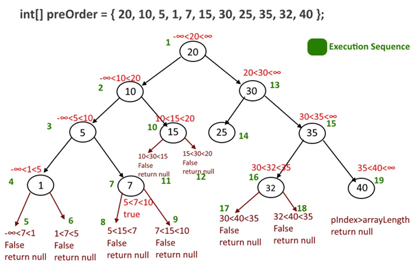
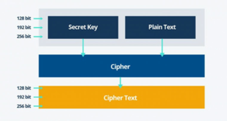
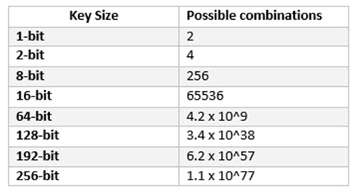

# [Algoritmizace - Rekurze, Brute Force, Heuristiky, Nedeterministické algoritmy](https://youtu.be/wp_Zli_cgZw?si=sAHSumwAF2QL3NIx)

## O čem mluvit?
- Rekurze - *tu brát ze začátku teoreticky pak až přejít na tu v programování*
	- objekt vola sam sebe
    - využití
	- Typy rekurze
		- přímá / nepřímá (volá sebe / volá b, b volá a)
		- lineární / stromová (vola sebe / vola jich víc)
- Brute force - *ten téměř citovat*
    - deterministický algoritmus
    - pouzivan na prolomení kódu 
    - časová náročnost je astronomická 
- Heuristiky
    - zkusmé řešení problémů 
    - nevím jak de dostat k výsledku 
    - můžu diky tomu upřesnit např Brute Force 
- Determenistické vs Nedeterministické algoritmy - *tady nejde říct mnoho, je to "třešnička na dortu"*
    - det. = vzdy stejný výsledek za stejnych podmínek 
    - nedet. = vzdy jiný výsledek za stejných podmínek 

## Rekurze
- tj. když objekt je součástí sám sebe
- v programování je to prakticky cyklus
	- procedura nebo funkce je zavolána znovu, než je dokončeno její předchozí volání
- u některých úloh to může vést k rychlému a efektivnímu řešení
	- nemusí ale být optimální
- pokud se snažíme program optimalizovat z hlediska paměti, rekurzi se snažíme omezit, či kompletně eliminovat

## Typy rekurze
- rekurzi dělíme na dva základní typy na základě toho, kolik podprogramů se jí účastní

#### Rekurze může probíhat přímo nebo nepřímo:
- **přímá rekurze** volá sama sebe
- **nepřímá rekurze** je když vzájemné volání podprogramů tvoří kruh
	- příkladem je situace, kdy funkce A volá funkci B, která opět volá A

#### Podprogram může být volán jednou, nebo vícekrát
- **lineární rekurze** je když podprogram při vykonávání svého úkolu volá sama sebe jen jednou
- **stromová rekurze** je když se funkce v rámci jednoho vykonávání úkolu zavolá vícekrát. Strukturu volání lze znázornit jako binární strom (viz obrázek)

Python:
```python
# Přímá lineární rekurze (A() -> A() -> ...)
def A():
    A()  

# Nepřímá lineární rekurze (B() -> C() -> B() -> ...)
def B():  
    C()  

def C():  
    B()

# Přímá stromová rekurze (D() -> 2*D() -> 2*D() -> ...)
def D():
	return D(), D()
```


## Brute Force
- deterministický algoritmus
- velmi rozsáhle používaný postup
- obvykle slouží k prolomení hesla, či celých přihlašovacích údajů
- proces je automatizovaný
#### Časová komplexnost
- čas potřebný k prolomení hesla roste exponenciálně s délkou klíče 
	- uváděno v bitech (používají se 128 a 256)
	- zvětšuje se tím prostor klíče.
- velký prostor klíčů je tak nutnou podmínkou pro bezpečnost šifry
- k prolomení symetrického klíče o délce 256 bitů je zapotřebí 2128 krát vyšší výkon, než k prolomení 128 bitového klíče 
	- za předpokladu, že by jsme disponovali strojem se schopností ověřit trilion (1018) klíčů za sekundu stále by dešifrování trvalo 3x1051 let

Python:
```python
key_to_discover = 800815

def discover_key(key):
	try_key = 0
	while True:
		if try_key == key:
			print(f"Key discovered! -> {key}")
			break
		else:
			try_key += 1

# Tohle je extrémně simplifikovaný příklad, ale v jádru jde o to samé, prostě je to pokus-omyl algoritmus - zkouší všechny možné kombinace, dokud nenalezne tu co hledá.
```




## Heuristiky
- heuristika je v podstatě zkusmé řešení problému
- obvykle označení pro algoritmy které:
	- neposkytují záruku kvality řešení 
	- pokud nevíme, jestli heuristika uspěje
- dokáží zrychlit Bruteforce, upřednostňují nějaké řešení a nějaké i vynechají
- vhodné tehdy, pokud neznáme přesný postup, jak dojít k cíli
	- toto řešení nemusí být ale jsou dostatečně přesné a rychlé
		- např.: rozhodnutí bota v šachách

#### Nejčastější metody Heuristiky:
- **Generický algoritmus** 
	- algoritmus založený na principu přirozeného výběru
	- na základě předem daných kritérií rozhoduje, jakou hodnotu upřednostní
	- dokáže najít kvalitní řešení i složitého problému, v oblasti IT je velmi rozsáhle používané
- **Metoda lokálního hledání** 
	- tyto metody vyhodnocují jen své nejbližší okolí a vydají se při prohledávání zkrátka některým směrem, který se v tu chvíli zdá metodě lokálně optimální na základě vyhodnocení funkce
	- lokální metody ale zcela zapomínají předcházející uzly a postrádají tak možnost návratu
- **Iterativní metoda** 
	- využívá postupného hledání řešení ve stále se zužující oblasti řešení 
	- postupně se z dobrého řešení dopracovává k ještě lepšímu řešení

## Determenistické / Nedeterministické algoritmy
#### Determenistické
- za stejných podmínek vrátí vždy ten stejný výsledek

#### Nedeterministické
- za stejných podmínek **ne**vratí vždy ten stejný výsledek
- např.: MonteCarlo, Hod kostkou
- RNG není úplně nedeterministický (generuje ho procesor, stroj z křemíku, nebo se generuje podle času/tlaku v atmosféře, ..., takže by se dalo velmi složitě předpovědět) ale bude se u maturity brát jako nedeterministické
