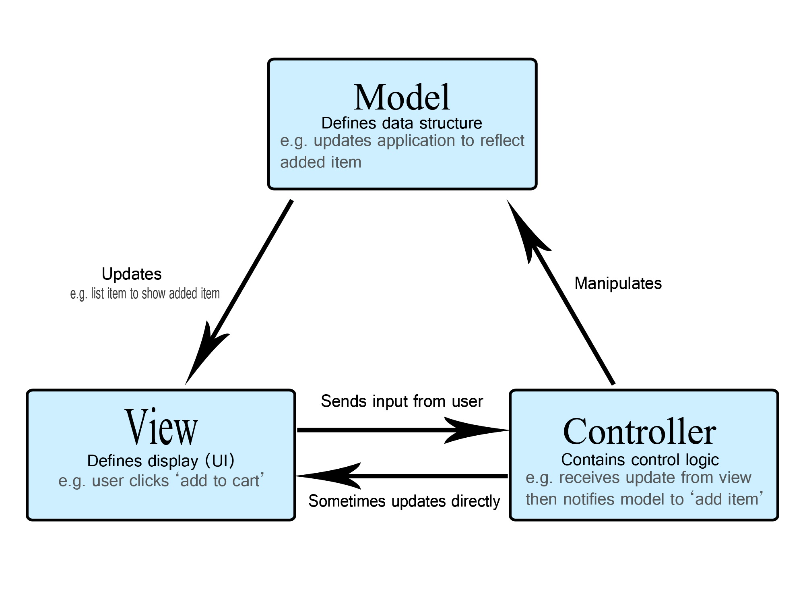
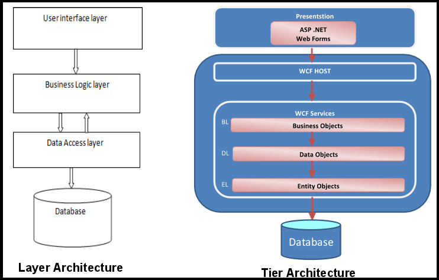
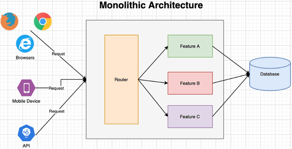
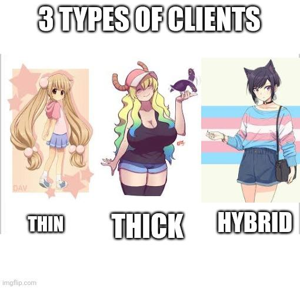
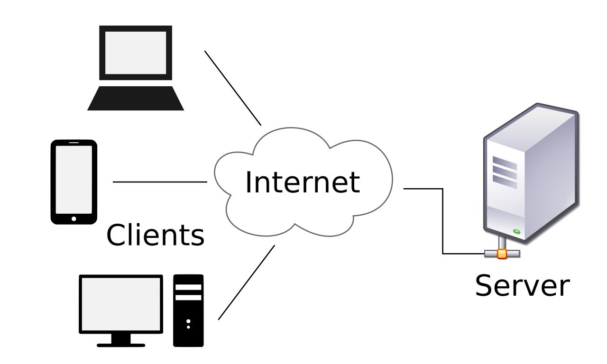
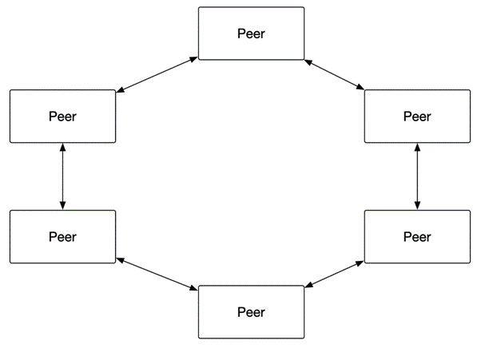

# [Architectural design patterns - MVC, Multitier, Monolithic, P2P, Client/Server](https://youtu.be/OCakUH77JY8?si=6gE-fGYg_u_E7xCV)
*Jednoduché téma ale pozor abyste nikam nespěchali*

## O čem mluvit?
- Architektonické návrhové vzory
    - co to je?
    - výhody/nevýhody obecně
    - vztahy mezi objekty (Client-server, MVC..)
    - charakteristika objektů
    - využití
    - příklady aplikací..
- MVC
- Multi-tier
- Monolithic
- P2P
    - rozdíl oproti client/server
- Client/Server

## Co je to design pattern?
- architektura design patternu je způsob návrhu řešení problému 

## MVC
- Model-View-Controller
- základní myšlenkou je oddělení logiky od výstupu
- účelem je zajistit dlouhodobou udržitelnost kódu
- oblíbený design pattern pro desktopové využití i webdev
- je součástí populárních webových frameworků, z C# ASP.NET

#### Skládá se ze 3 částí
- **Model** - datový model
	- obsahuje logiku a zajišťuje práci s daty
	- komunikuje s databází, CRUD, provádí kalkulace a validaci dat
- **View** - uživatelské rozhraní (např.: webová stránka)
	- obstarává pohled uživatele na data
- **Controller** - řídí logiku (např.: server)
	- prostředník mezi ostatnímy komponenty
	- reaguje na změny dat a události vyvolané uživatelem
	- na jeho základě aktualizuje View

## Multi-Tier / Multi-Layer
- vícevrstvá architektura
	- aplikace je rozdělena do několika vzájemně komunikujících vrstev
- nejběžnějším příkladem je třívrstvá architektura
- komunikace mezi úrovněmi je většinou asynchronní

| Multi-Tier                                                                                                                   | Multi-Layer                                        |
| :--------------------------------------------------------------------------------------------------------------------------- | -------------------------------------------------- |
| na více strojích                                                                                                             | na jednom počítači                                 |
| pro větší aplikace                                                                                                           | pro menší aplikace                                 |
| úrovně komunikují pouze pomocí hodnot přes síť nebo přes sériový kabel                                                    | vrstvy komunikují pomocí  referencí nebo hodnot |
| dosahuje lepšího výkonu, protože je  na více servech                                                                      |                                                    |
| jednotlivé vrstvy aplikace vyvíjené v této  architektuře od začátku, můžeme kdykoliv  umístit na určité fyzické stroje |                                                    |

## Monolithic
- typická pro centralizované zpracování
	- vhodné pro pidimidi aplikace
- program běží na jednom počítači 
- komponenty a funkce programu jsou vzájemně propleteny v sobě a jsou na sobě závislé
- snadné zajišťování ochrany a prevence proti výpadkům + lehčí testování

#### Problémy
- je v podstatě obrovský masivní kus kódu plný závislostí
- obtížná údržba
	- všechno je jak jedna plácanina trusu
	- orientace v kódu, přechod na jiný druh technologie či updaty jsou časově náročné
		- obvykle pro aktualizace musí být přepsaná celá aplikace
- obtížná přenositelnost aplikace mezi různými platformami 
	- aplikace s monolitickou architekturou jsou spojeny s jednou platformou jako s pupeční šňůrou

## Client / Server
- jedním z nejpoužívanějších návrhových vzorů
- operuje na principu vztahu mezi dvěma programy
	- klient - žádá o služby
	- server - služby poskytuje
	- každý klient může poslat žádost o data jednomu, či více připojeným serverům. Na druhé straně, servery mohou tuto žádost přijmout a klientovi vrátit požadovanou informaci
- používán v HTTP, SMTP, DNS, ...

#### Client má 3 typy:
- **Thin** 
	- využívá prostředky hostitelského počítače 
	- jeho úkolem je pouze serveru poslat data, server je zpracuje
	- klient po ukončení spojení ztratí všechna data
	- např.: připojení přes PuTTy
- **Thick**
	- nespoléhá se na server
		- často může pracovat bez připojení k serveru
	- provádí zpracování dat sám
	- ukládá data na lokální uložiště.
	- server slouží jako uložiště dat, k synchronizaci.
- **Hybrid**
	- spojení Thick a Thin
	- data zpracovává sám, ale neukládá je lokálně 
	- server slouží  jako jediné uložiště dat

#### Výhody
- jednoduchá správa (na rozdíl od P2P)
- server smí omezit určitým uživatelům přistup k určitým zdrojům či naopak
- lepší zabezpečení přístupu k datům
	- malware se hůře šíří

#### Nevýhody
- v případě vytíženého serveru klient může čekat déle na odpověď
- vyžaduje více zdrojů a výkonu 
	- server musí odpovídat na všechny dotazy od všech klientů

#### Příklady
- Webový prohlížeč, kdy klientský program na počítači uživatele může přistupovat k informacím na libovolném webovém serveru na světě. 
- Pokud byste chtěli zkontrolovat zůstatek na svém bankovním účtu, váš prohlížeč předá váš dotaz webovému serveru vaší banky, ten předá dotaz databázovému programu, který pošle dotaz databázovému serveru. Odsud je hodnota zůstatku na vašem bankovním účtu vrácena zpět databázovému systému, který jej pošle do vašeho prohlížeče a výsledný zůstatek zobrazí.

## P2P
- Peer To Peer
- není klient ani server
- skládá se ze skupiny rovnocenných peerů
	- mají stejnou roli a funkci 
	- pracují zároveň jako přijímač a vysílač dat a zdrojů
- neexistuje žádný centrální ovládací prvek
- používají se na sdílení zdrojů a spolupráci více počítačů, třeba výpočetní výkon, nebo stahování dat z internetu

#### Výhody
- stačí jen dva uzly
- další uzly se mohou kdykoli připojit
- uzly se mohou kdykoli odpojit

#### Nevýhody
- decentralizovaná
	- složité provádění obnovy dat či backup
	- složitější administrace
- spadne-li jeden Peer, jde dolů celá síť
- jednodušší po síti šířit viry a útoky
	- Trojan, Spyware, DDos

