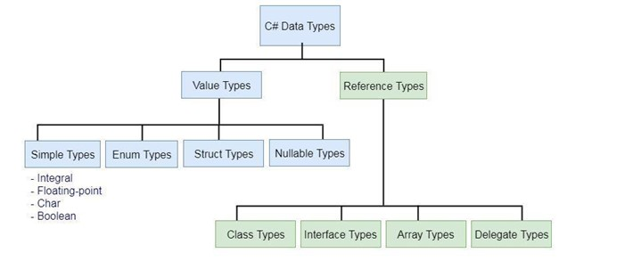

# [Datové typy, Generika, Výčtové datové typy, Struktury, Anotace, Operátory](https://youtu.be/aEObhZafNgU?list=PLmW7bUCTvOeTSag9ZZBYXdHs_iEwB4OHM)
*(Videoprezentace není přímo na toto téma ale dotýká se ho)*
 *Na tohle Manďa hodně apeloval ať nezačneme mluvením o tom že existuje int, string atd... Spíš je dobřý začít jak se dělí kam se řadí a pak až nějak zmiňovat konkrétní typy.*

## O čem mluvit?
- Datové typy a jejich rozdíly
    - typy (číselné, řetězce, bool, objekty)
        - složité vs. primitivní
            - proč string není primitive (char array)
    - velikost v paměti
    - int vs float / decimal (Floating point)
    - mutable vs immutable
    - zmínit null
- Generika
    - využití
    - příklad
    - výhody / nevýhody
- Výčtové datové typy (ENUM)
    - jak to funguje?
    - příklady využití
- Anotace
    - využití => Kde jsem to viděl? (unit testy)
    - k čemu slouží?
- Operátory
    - typy operátorů (aritmetické, relační, bitové, logické, ternární, přiřazovací)
    - operator overloading

## Datové typy
- definice hodnoty, které smí proměnná nebo konstanta nabývat
- součástí programovacího jazyka je definice základních datových typů
	- pomocí těchto základních typů může ve většině jazyků můžeme tvořit nové složené typy



### Ordinální datové typy
- tvoří lineárně uspořádanou množinu
	- pro každý prvek je přesně definovaný předchůdce i následovník 
		- (z posledního prvku ve většině jazyků dochází k přetečení na první)
	- z funkčního hlediska tak lze k jednoduchým celočíselným datovým typům řadit i výčtový typ, i když jeho hodnoty jsou definovány programátorem.
- ordinální celočíselné datové typy jsou základem současné informatiky

#### Boolean (logická hodnota)
- **True** nebo **False** / **1** nebo **0**
- některé jazyky ale neumí 1 a 0, např.: Python a C to umí

Python:
```python
is_true = True
```

C:
```c
int is_true = 0;

// Nebo:
typedef int bool; 
bool is_true = true;
```

C#:
```csharp
bool is_true = true;
```

#### Integer (celé číslo)
- má určitý rozsah čísel 
- může přetéct
- různé možnosti zápisu: 0, 12, -5651, 0xA9
- programovací jazyky mohou (ale nemusí) rozlišovat celá čísla bez znaménka a se znaménkem
- některé jazyky (např. Python) místo přetečení pro číslo vyhradí větší množství paměti, tím je usnadněno programování, avšak snižuje se výkon programu
- můžeme provádět matematické a logické operace mezi čísly, pomocí operátorů (+, -, *, /, <, >, \==, <=, >=), na složitější matematické operace se většinou využívají vlastní metody nebo knihovny (např. odmocniny)

Python:
```python
number = 16
neg_num = -32
```

C:
```c
int number = 16;
int neg_num = -32;
int hex_num = 0xA9;
```

C#:
```csharp
int number = 16;
int neg_num = -32;
```

#### Char (znak)
- využívá se kódování (ASCII/Unicode), ve skutečnosti je znak v počítači reprezentován pomocí celého čísla
- využit zejména na stringy

Python:
```python
character = "a"
```

C:
```c
char ch = "$";
```

C#:
```csharp
char cha = "2";
```

### Neordinální datové typy
- není jednoznačně určen předchůdce a následovník každé hodnoty
				
#### Float, Double, (for)Real (reálné čislo)
- zápis čísla s tečkou podle anglosaské konvence (3.14)
- nelze reprezentovat všechna čísla stoprocentně správně
- reálná čísla se v počítači mohou chovat jinak, než by se intuitivně dalo čekat
- v počítači bývá většinou implementováno ve dvojkové soustavě jako _mantisa_ * 2^_exponent_, kde _mantisa_ a _exponent_ jsou celá čísla
- zásadní výhodou reálných čísel je, že mohou ve stejné velikosti paměti reprezentovat mnohem větší rozsah hodnot, než celé číslo
- cenou za vyšší dynamický rozsah je horší přesnost u velkých čísel (což často nevadí) a vyšší nároky na architekturu procesoru

- **Float** 
	- 6 až 7 desetiných míst
- **Double**
	- až 15 desetiných míst

Python:
```python
pi = 3.14
f = 1.45e3
e = float(2) #bude to 2.0
```

C:
```c
#include <stdio.h>

float f = 255.06f;
double d = 15.8989;
```

C#:
```csharp
float myNum = 5.75F;
double myDoubleNum = 5.99D;
```

### Prázdný datový typ
- **void** – jedná se o specialitu jazyka C, tento typ nenabývá žádných hodnot, může sloužit mimo jiné pro deklaraci funkce, která nemá návratovou hodnotu, nebo označovat data nespecifikovaného typu
- v některých jazycích existuje rovněž prázdná hodnota ošetřující neplatný výsledek - _null_ nebo _nil_, která je vlastně současně zvláštním datovým typem, výsledkem většiny operací s konstantou nil je opět nil, takže chování programu je deterministické

Python:
```python
nothing = None

if nothing is None:
	print("nothing")

def no_ret_fun():
	pass

if no_ret_fun() is None:
	print("nothing again")
```

C:
```c
// využití hlavně v pointerech
#include <stdio.h>

int main(void) {
  int * p_some_variable = NULL;

  if (p_some_variable == NULL) {
    printf("equal");
  }
}
```

C#:
```csharp
string s = null;
```

## Generika
- nejjednodušší definicí generik je **obecný datový typ**
- když chceme dát uživateli volnost, aby si mohl vybrat libovolný datový typ, používají se právě generika 
	- zejména se tak hodí jako vstupní proměnné do metod či pro listy
- např.: 
	- Běžně užíváme listy. Listy nemají předem nadefinovaný datový typ, ale používají generikum. Při vytváření listu, tak musíme přesně určit ve špičatých závorkách, co chceme ukládat:
		- ```csharp
		  List<int> cisla = new List<int>();
		  List<string> stringy = new List<string>();
		  List<bool> booleany = new List<bool>();
	- Pro vytváření takové generické třídy se taktéž používají špičaté závorky. Třída pro práci s listem tak může vypadat třeba následovně:
		- ```csharp
		  class Genericka_trida<T> {
			  List<T> listik;
			  public Genericka_trida() {
				  listik = new List<T>();
			  }
			  
			  public void pridatPrvek(T prvek) {
				  listik.Add(prvek);
			  }
		  }
		- Tzn. Vytvořil jsem si generickou třídou pomocí špičatých závorek u jména třídy a dále nějakou příkladovou ukázku použití - vlastní třída pro práci s listem.

- Obecně nezáleží, jaké písmeno do špičatých závorek zvolíme. Nejčastěji se používá T.

## Struktury
- struktury jsou podobné třídám
- používají se pro ukládání menších kolekcí dat, přičemž žádná z jeho vlastností nesmí být referenční datový typ. Na rozdíl od tříd:
- **nejsou referenční datový typ**. Tzn. data se ukládají přímo na zásobníku => pokud nepotřebujeme používat metody dané struktury
- nemohou dědit od jiných tříd ani být děděny
- nemůže se změnit konstruktor, který nemá vstupní parametry

Python:
```python
#nejsou, nepoužívají se v Pythonu (podle toho co jsem našel)
```

C:
```c
#include <stdio.h>

struct myStructure {  
  int myNum;  
  char myLetter;  
};  
  
int main() {  
  struct myStructure s1;  
  
  s1.myNum = 13;  
  s1.myLetter = 'B';  
  
  printf("My number: %d\n", s1.myNum);  
  printf("My letter: %c\n", s1.myLetter);  
  
  return 0;  
}
```

C#:
```csharp
using System;
namespace CsharpStruct {
 
  struct Employee {
    public int id;

    public void getId(int id) {
      Console.WriteLine("Employee Id: " + id);
    }
  }
 
  class Program {
    static void Main(string[] args) {
    
      Employee emp;
      
      emp.id = 1;

      emp.getId(emp.id);

      Console.ReadLine();
    }
  }
}
```

## Výčtové datové struktury
- výčtové datové typy nefungují jako ty klasické
- používáme je ve chvíli, kdy chceme dát na výběr z **pevně daných možností, které se nemění**
	- neslouží tak pro dynamické ukládání hodnot, jako klasické proměnné. 
- nejpoužívanější je **enum**
- příklady enum: dny v týdnu, měsíce, názvy levelů, stavy, atd.

Většinou se k jednotlivým hodnotám enum přiřazuje numerická hodnota (index)
Hodnoty enum se používají jako konstanty

Python:
```python
from enum import Enum

class Season(Enum):
	SPRING = 1
	SUMMER = 2
	AUTUMN = 3
	WINTER = 4
```

C:
```c
typedef enum{FALSE, TRUE} boolean;
typedef enum{Po, Ut, St, Ct, Pa, So, Ne} den;

boolean splneno = TRUE;
den streda = St;
```

C#:
```csharp
class Program
{
  enum Level
  {
    Low,
    Medium,
    High
  }
  static void Main(string[] args)
  {
    Level myVar = Level.Medium;
    Console.WriteLine(myVar);
  }
}

-> Medium
```

## Anotace
- dodání metadat k funkcím, proměnným, třídám, ...
- poskytují dodatečné informace o jejich zamyšlením použití nebo chování. Anotace jsou obvykle používány kompilátory, interprety nebo jinými nástroji k uplatňování omezení, optimalizaci kódu nebo generování dokumentace.
- běžně začínají znakem @ (např. klasický @override)

Mohou sloužit k:
- určení datového typu parametru funkce
- typicky používáno v Javě, C#, atd kde je tato anotace nutná, ale může být použito i v Pythonu, GDScriptu jako doporučení, jaký typ má jít do funkce

Python:
```python
def say_phrase(phrase : str) -> str:
	return f"{phrase}"
```

- validační anotace k ověření vstupních parametrů zda nejsou Null

Java:
```java
public void process(@NotNull String data) {
    ...
}
```

- serializační anotace k naznačení jak se má kód chovat při serializaci/deserializaci dat
Java:
```java
public class User {
    @JsonProperty("username")
    private String name;
    ...
}
```

- dokumentační anotace k automatické generaci dokumentace
Java:
```java
/**
 * Vrací součet dvou čísel.
 * 
 * @param a První číslo.
 * @param b Druhé číslo.
 * @return Součet a a b.
 */
public int add(int a, int b) {
    return a + b;
}
```

Je mnoho dalších anotací.


## Operátory
- symbol (nebo řada symbolů) využívaný k reprezentaci matematických či logických operací mezi proměnnými nebo hodnotami.
- každý programovací jazyk má svoji škálu použitelných operátorů, základní operátory jako např. +, -, \*, /, bývají všude stejné.

#### Aritmetické
- Používají se k základním matematickým operacím
- **Součet:** +
- **Rozdíl:** -
- **Součin:** \*
- **Podíl:** /
- **Modulo:** % nebo *mod* (zbytek z dělení)
(Myslím že tyhle všichni známe takže příklad je zbytečný)

#### Relační
- Používají se k porovnání dvou hodnot
- Nejčastější použití v **if**ech
- **Rovnost:** == nebo eq
- **Nerovnost:** != nebo ne
- **Větší než:** > nebo gt
- **Menší než:** < nebo lt
- **Větší rovno:** >= nebo ge/gte
- **Menší rovno:** <= nebo le/lte

#### Logické
- Logické operace AND, OR, atd...
- **Negace:** not nebo !
- **Konjunkce:** and nebo &&
- **Disjunkce:** or nebo ||
- **Non-ekvivalence:** xor nebo ^

#### Ternární
- Zjednodušeně: zapsání if podmínky na jeden řádek :D

Příklad:
```java
if (podmínka) {
    výraz1;
} else {
    výraz2;
}
```
Můžeme zapsat takto:
```java
podmínka ? výraz1 : výraz2;
```

#### Přiřazení
- Snad nejpoužívanější z 
- Používá se k přiřazení hodnoty k proměnné
- **Přiřazení:** =

```c
int num = 10;
```