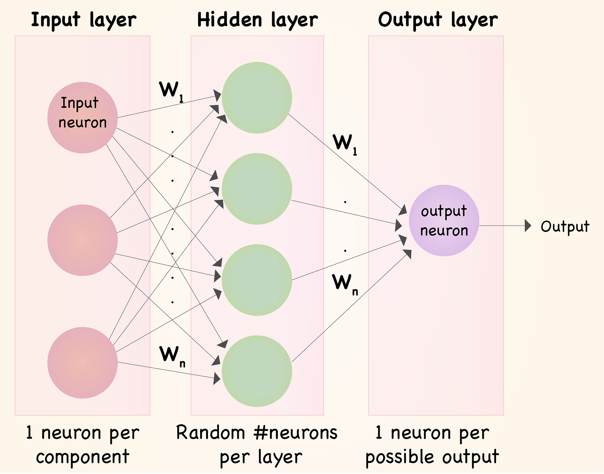
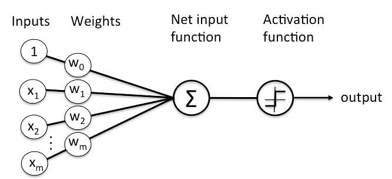

# Strojové učení s využitím umělých neuronových sítí

## O čem mluvit?
- neuronová síť
	- vzorem je mozek
	- struktura pro paralelní zpracování dat
## Neuronová síť
- jeden z výpočetních modelů v umělé inteligenci
	- vzorem je mozek a chování neuronů v něm
- je to struktura určená pro distribuované paralelní zpracování dat
	- skládá se z umělých neuronů
- využívá se hlavně u problémů co nedokáže vyřešit lineární regrese
- má vysoké nároky na výpočetní sílu (kvůli tomu se využívá zřídka)

Cílem je nastavit síť tak, aby dávala co nejpřesnější výsledky
-  zkušenosti jsou ukládány jako váhy - mat. ekvivalent synapsí
Fáze učení neuronové sítě bývá nazývána adaptivní, fáze vybavování po naučení neuronové sítě bývá nazývána aktivní
Učení neuronové sítě rozlišujeme na:
- supervised learning
- unsupervised learning)
#### Neuron
- umí držet hodnotu (číslo)
- představuje nějakou funkci
	- funkce se navzájem překrývají mezi neurony
- neurony jsou vzájemně propojeny
- navzájem si předávají signály a transformují je pomocí aktivačních přenosových funkcí
- **neuron má libovolný počet vstupů, ale pouze jeden výstup.**
#### Využití
- rozpoznávání obrázků, řeči
- analýza psaného textu - OCR
- filtrování spamu
- ...

### Perceptron
- nejjednodušší neuronová síť
- má pouze z jeden neuron
- má _n_ vstupů, jeden výstup
- nejdřív se násobí vstupy s vahamy, tyto výsledky se sečtou, součet se pak "prožene" aktivační nelineární funkcí, často sigmoida

### Algoritmus zpětné propagace chyby
- používá se pro spočítání úpravy vah u jednotlivých neuronů
	- pro jejich spočítání se používají nejdříve sample testovací data
	- výsledná data poté vezmeme a porovnáme je s tím jaký výsledek by měly testovací data mít
	- následně upravíme váhy aby jsme případnou odchylku/chybu zmenšili
- nejprve se upravují váhy v první vrstvě (layer) od **výstupního** neuronu tím zas vznikne nová chyba kterou budeme upravovat v následující vrstvě (layer) a postupně se vracíme zpátky až do vrstvy u vstupních neuronů

Deep learning se říká neuronové síti s velkým množství neuronů a vrstev s nimi.

[Příklady na Google Colab](https://colab.research.google.com/drive/1XDJuMFQyvx5vTVE5E4BQCZwLbVs1YJGa?usp=sharing#scrollTo=LCNMnvvGvpM3)

[Video na pochopení neuronů](https://youtu.be/aircAruvnKk?si=C9XAgIpqNWmIsXJ3)
