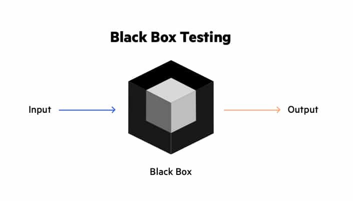

# [Testování, Unit testování a dokumentace zdrojového kódu](https://youtu.be/8X5PS8CZyIs?si=cg49xrzwNqY5VgCP)
## O čem mluvit
- Testování
	- Vysvětlení procesu testování a jeho důležitosti při vývoji softwaru.
	- Identifikace různých typů testování a jejich účelu (unit testování, regression testing, integration testing).
	- Vytváření a používání test caseů jako základního nástroje pro testování kódu.f
- **Unit testování:**
	- Detailní vysvětlení konceptu unit testování a jeho výhod.
	- Ukázka psaní a používání unit testů pro testování jednotlivých funkcí nebo modulů.
	- Diskuse o nejlepších praktikách pro psaní efektivních unit testů.
- **Dokumentace zdrojového kódu:**
	- Důležitost a výhody dokumentace zdrojového kódu pro udržitelnost a spolupráci v týmu.
	- Představení různých stylů dokumentace zdrojového kódu (např. docstrings, komentáře, README soubory).
	- Ukázka psaní kvalitní dokumentace zdrojového kódu pomocí populárních konvencí a nástrojů.
## Testování
- důležitá součást vývoje
- proces při kterém porovnáváme očekávané výsledky s těmi reálnými
- testování napomáha při objevování potencionálních chyb
    - "Jak mohu tento kód rozbít?"
- proces testů:
	- Plánování testů
		- plán co budu a jak testova
	- Analýza a příprava
		- např. psaní unit testů, příprava programu a testů
	- Vykonání testu
		- spuštění (unit) testů a sledování výsledků
		- vyhodnocení testů
#### Co testujeme? - Kvalitu (FURPS)
- **Functionality** - správné chování systému a funkcí
- **Usability** - zda jde program použít na to co jsme chtěli a je použitelný uživateli
- **Reliability** - zda se chová (i při přetížení) tak jak má a nedochází k chybám (umí chyby hlásit?)
- **Performance** - jestli je systém rychlí a zvládne to co má a neber moc zdrojů
- **Supportability** - instaluje se lehce? funguje na HW a SW jakém má?

### Dělení testování
#### Typy testů
- **Integrační testy** 
	- test celkového kódu
	- testují interakce mezi různými komponentami nebo moduly
	- ověřují, zda spolupracují správně
- **Unit testy**
	- testují nejmenší testovatelnou jednotku kódu
	- ověřují, zda se chová správně, nezávisle na ostatních částech systému
	- pokud nalezneme v Unit testu bug, funkci opravíme a používáme Regression testing
        - kontroluje, zda opravení bugu nevytvořilo nové chyby ve zbytku kódu
        - pokud ano, vracíme se k **Unit testingu**
- **Modul Testy**
	- testují celé funkční moduly kódu
	- ověřují, zda spolupracují správně s jinými moduly
- **Testy komponent**
	- testují celé funkční komponenty systému
	- ověřují, zda pracují správně při interakci s ostatními komponentami
- **Funkční testy**
	- testují, zda systém splňuje specifikované funkční požadavky
- **Systémové testy**
	- testují celý systém jako celek
	- ověřují, zda splňuje požadavky a funguje správně v prostředí, kde bude nasazen
- **Akceptační testy**
	- testují, zda systém splňuje požadavky uživatele a je připraven k uvedení do produkce
#### Dle znalosti kódu
**Black box testování**
- blackbox, protože nevidíme dovnitř

```python
    def sqrt(x, eps):
        """ 
        Assumes 
	        x, eps floats, x>= 0, eps > 0
        
        Returns 
	        res such that x=eps <= res*res <= x+eps 
	    """
```

  <table>
    <tr>
      <th>CASE</th>
      <th>x</th>
      <th>eps</th>
    </tr>
    <tr>
      <td>boundary</td>
      <td>0</td>
      <td>0.0001</td>
    </tr>
    <tr>
      <td>perfect square</td>
      <td>25</td>
      <td>0.0001</td>
    </tr>
    <tr>
      <td>less than 1</td>
      <td>0.05</td>
      <td>0.0001</td>
    </tr>
    <tr>
      <td>irrational square root</td>
      <td>2</td>
      <td>0.0001</td>
    </tr>
    <tr>
      <td>extremes</td>
      <td>2</td>
      <td>1.0/2.0**64.0</td>
    </tr>
    <tr>
      <td>extremes</td>
      <td>1.0/2.0**64.0</td>
      <td>1.0/2.0**64.0</td>
    </tr>
    <tr>
      <td>extremes</td>
      <td>2.0**64.0</td>
      <td>1.0/2.0**64.0</td>
    </tr>
    <tr>
      <td>extremes</td>
      <td>1.0/2.0**64.0</td>
      <td>2.0**64.0</td>
    </tr>
    <tr>
      <td>extremes</td>
      <td>2.0**64.0</td>
      <td>2.0**64.0</td>
    </tr>
  </table>

- Testy vytváříme na základě specifikací a požadavků, které o funkci víme, nikoliv na základě kódu samotného
    - Black box testy budou vždy fungovat nehledě na to, jak někdo dannou funcki implementuje
        - Pokud ji samozřejmě implementuje podle danných specifikací :)
- Rysy
        - Nezávislost na vnitřní implementaci (na programátorovi)
        - Založeno na specifikacích a požadavcích
### **Glass box testování**
Příklad:
```Python
  def abs(x):
    """ Assumes x is an int
    Returns x if x>=0 and -x otherwise """
    if x < -1:
        return -x
    else:
        return x
```

  - Path complete může přejít chybu
  - Path complete je v tomto případě `2` a `-2`
  - Ale `abs(-1)` nesprávně vrací `-1`
  - Musíme kontrolovat i boundary cases (`-1`)

- Narozdíl od blackbox testování používáme samotný kód
- Path complete test je test Case, který prochází každou možnou cestou v kódu
- Problém přichází u cyklů
    - "Kód neprojde cyklem ani jednou"
    - "Kód projde cyklem jednou"
    - "Kód projde cyklem dvakrát"
    - ...
    - Možnost velmi velkého testu
- **Pravidla glassbox testování**
    - **Větvení**
        - Musíme mít test case, který prochází všechny možné větve
    - **Cykly**
        - Musíme mít test case, který
            - Neprochází cyklem
            - Prochází cyklem
                - Jednou
                - Vícekrát
        - **While cykly**
            - Stejné jako ostatní cykly
            - Test casy, které zachycují všechny možné způsoby opuštění cyklu
## Dokumentace zdrojového kódu
- **Důležitost dokumentace:**
  - Dokumentace zdrojového kódu je klíčová pro porozumění funkčnosti, použití a účelu jednotlivých částí kódu.
  - Dobrá dokumentace zjednodušuje údržbu, rozvoj a spolupráci v týmu, protože umožňuje rychlejší a snazší orientaci ve zdrojovém kódu.
- **Typy dokumentace:**
  - **Docstrings:** Jsou to řetězce umístěné na začátku funkce, třídy nebo modulu, které popisují jejich účel, vstupy, výstupy a použití.
  - **Komentáře:** Jsou to poznámky v kódu, které vysvětlují určité části kódu, složitější algoritmy nebo zvláštní přístupy.
  - **README soubory:** Jsou to textové soubory umístěné v kořenovém adresáři projektu, které poskytují přehled o projektu, instrukce pro instalaci a použití, a další důležité informace.
- **Kvalita dokumentace:**
  - **Jasnost:** Dokumentace by měla být jasná, stručná a snadno srozumitelná pro čtenáře.
  - **Relevance:** Dokumentace by měla obsahovat pouze relevantní informace související s funkcí, třídou nebo modulem.
  - **Aktualizace:** Je důležité udržovat dokumentaci aktuální a synchronizovanou s aktuálním stavem kódu.
- **Konvence a standardy:**
  - Je vhodné dodržovat konvence a standardy psaní dokumentace definované v rámci projektu nebo komunity (např. PEP 8 pro Python).
  - Konzistentní používání formátování a stylu dokumentace usnadňuje čtení a porozumění kódu.
- **Nástroje pro generování dokumentace:**
  - Existuje mnoho nástrojů, které umožňují automatické generování dokumentace z docstrings (např. Sphinx pro Python).
  - Tyto nástroje umožňují vytvářet rozsáhlou a dobře strukturovanou dokumentaci zdrojového kódu s minimálním úsilím.
- <details><summary><a>Příklad</a></summary><hr/>
  
    ```Python
    def factorial(n):
        """Compute the factorial of a non-negative integer.
    
        Args:
        n (int): A non-negative integer.
      
        Returns:
        int: The factorial of n.
      
        Raises:
        ValueError: If n is negative.
        """
    
        if n < 0:
            raise ValueError("Factorial is not defined for negative numbers.")
        elif n == 0:
            return 1
        else:
            return n * factorial(n - 1)
    ```
    <hr/>
  </details>