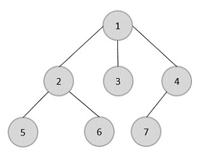
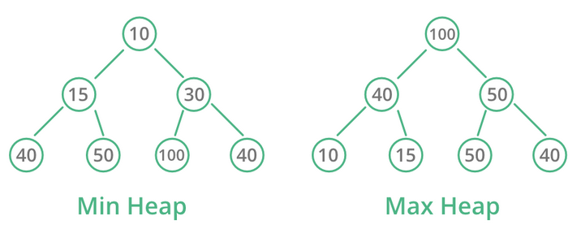

# [Typy datových struktur - Pole, Spojový seznam, Strom, Fronta, Zásobník, Halda](https://youtu.be/aEObhZafNgU?si=P6qXSro2iNYWajby)
## O čem mluvit?
- vysvětlit obecně, co to jsou datové struktury
- popsat pole, jak je uloženo
- popsat listy, jak jsou implementované pomocí polí
- popsat linkedlist, jeho vlastnosti a druhy, výhody a nevýhody
- popsat stromy, jak fungují, co to je binární strom
- popsat haldu, jaké podmínky musí splňovat
- popsat frontu a stack, hlavní metody obou, čím se liší
## Pole/Array
- jednoduchá datová struktura, představuje počet prvků seřazených v paměti
- má neměnnou velikost, nedá se rozšiřovat ani zmenšovat, po celou dobu existence zabírá stejné množství místa
- k prvkům přistupujeme pomocí indexu, většinou jsou prvky indexované od 0, až na některé jazyky
## ArrayList/List/Pole s variabilní velikostí
- abstrakce nad polem, kde se velikost může měnit
- funguje tak, že v případě potřeby vytvoří nové pole s novou velikostí a nakopíruje do něj data ze starého
- často se list jen zvětšuje a nikdy se nezmenšuje
## Spojový seznam/Linked list
- datová struktura, ve které se data ukládají ve samostatných objektech, které zároveň odkazují referencí na další objekty
- výsledkem je spojený seznam prvků, které ale mohou být rozházené na různých místech v paměti
- výhoda je, že přidání nové nody je velmi rychlá operace, co zabírá konstantní čas
- nevýhoda je, že získávání prvků je pomalé
	- pro získání např. 20 prvku musíme projít všech 19 předchozích, než se k němu přes reference prokoušeme
- mohou být **single-linked** či **double-linked**
	- v single-linked prvky odkazují jen na další prvek
	- v double-linked prvky odkazují na další i předchozí prvek
- prvnímu prvku se říká **head**, poslednímu se říká **tail**
- pro implementaci potřebujeme vytvořit dvě třídy
	- **LinkedList** = třída, která obsahuje metody s operacemi s kolekcí, odkazuje na head
	- **Node** = třída pro samotné prvky, obsahuje hodnotu a odkaz na další (a případně předchozí) prvek
## Strom/Tree
- datová struktura podobná linked listu, akorát každý prvek může odkazovat na několik prvků
- můžeme si ho představit jako hodnocený graf s několika pravidly
- na každý prvek může odkazovat maximálně jeden prvek, nemohou vznikat cykly
- vrchnímu prvku se říká **root** (kořen), prvkům na nejspodnější vrstvě se říká **leaf** (list)
- u prvků popisujeme vztahy mezi rodiči a potomky
- stromy mají hloubku podle toho jak moc je prvek vzdálený od rootu, např. strom na obrázku má hloubku 3

- častým druhem stromu je **binární strom**
	- prvky mohou mít vždy buď 0, nebo přesně 2 potomky
- stromy často slouží pro reprezentaci stavového prostoru
	- prohledávání stavového prostoru se dělá přes BFS a DFS, více v dokumentu o algoritmizaci a grafech
## Halda/Heap
- speciální druh binárního stromu, který splňuje podmínky
	1. jedná se vždy o kompletní binární strom, každý prvek musí mít dvě děti, až na poslední prvek který nemusí být zcela zaplněn, a tak může mít i 1 dítě
	2. haldu vždy zaplňujeme z leva do prava
	3. hodnoty potomků rodiče musí mít vždy větší nebo menší hodnotu než rodič podle typu haldy
- typy haldy:
	- **Min-Heap**: potomci mají vždy větší hodnotu než rodič
	- **Min-Heap**: potomci mají vždy menší hodnotu než rodič

## Fronta/Queue
- datová struktura s rozšířitelnou velikostí
- pracuje na FIFO (first in, first out) principu, což znamená že prvky které byly do fronty přidány nejdříve z ní také nejdříve odejdou
- klasicky má dvě hlavní metody
	- **enqueue** = zařadí prvek do fronty
	- **dequeue** = odstraní prvek z fronty
- může být implementovaná jako list či linked list, záleží na potřebách a jazyce
- konci fronty se říká tail nebo rear, začátku se říká head nebo front
## Zásobník/Stack
- datová struktura s rozšířitelnou velikostí
- pracuje na LIFO (last in, first out) principu, což znamená že prvky které byly do zásobníku přidány nejpozději z něho nejdříve odejdou
- hlavní metody:
	- **push** = přidá prvek do zásobníku
	- **pop** = získá hodnotu vrcholu a odstraní ho
	- **peek** = vrátí hodnotu vrcholu ale neodstraní ho
- může být implementovaný jako list či linked list, záleží na potřebách a jazyce
- zásobník má vrchol (poslední přidaný prvek) a spodek (první přidaný prvek), top/bottom, nebo také dom/sub