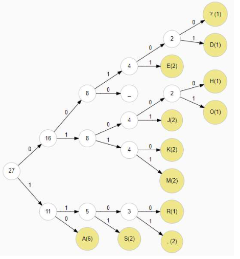

# Zpracování a parsování textových dat, regulární výrazy, kódování a stringy

## O čem mluvit?

- Parsování textu
  - Syntaktická analýza textu
  - Nejčastější metoda parsování = regex
  - Příklady parsovaných dat (logy, uživatelský vstup, soubory..)
- Regulární výrazy (RegEx)
  - Co je regex?
- Kódování
  - Speciální znaky - New line, backspace, tab..  
  - ASCII
  - UTF
- String
  - Co je to string?
  - Built in metody
  - Implemetace stringu
  - Proč je immutable?     
<hr/>

## Parsování textu
Co to je?
- Syntaktická analýza textu
- **Převedení dat z určitého formátu do jiného (použitelnějšího) formátu.**
- Vyhledávání v textu
<ul><li><details><summary>Příklad: [C#] Převedení "čísla" na int</summary>

```csharp
string s = "56"; // Toto "číslo" parsneme na int
int a = int.Parse(s); // Výsledkem bude int s hodnotou 56
```

<p>Používá se například u kalkulačky, kde uživatel zadá číslo ve formě textu a aby mohlo být číslo použito v příkladu tak je nejdříve potřeba ho převést do intu</p>

</details></li></ul>

### Regex
- Regulární výraz (**Reg**ular **Ex**pression)
- Textový řetězec, který slouží jako vzor pro hledání v jiném textovém řetězci

<ul><li><details>
	<summary>Cheat sheet pro regex</summary>
	<a href="https://cheatography.com/davechild/cheat-sheets/regular-expressions/">
		
	</a>
</details></li></ul>

## Kódování
- metoda, jak upravit přenášená data pro dané přenosové médium, tak, abychom jej využili co nejefektivněji
- Např. Morseova abeceda. Ta kóduje grafémy (znaky) latinky, číslice a další symboly / znaky pomocí sérií dlouhých a krátkých stisků telegrafního klíče, nebo kombinace dírek na děrném štítku nebo děrné pásce
- Kódování ve výpočetní technice pak rozumíme reprezentaci znaků nejčastěji celými čísly (např. Unicode)
- V kódování ASCII je pro znak písmene A určen kód 41 (v hexadeci-mální soustavě), a tedy 1000001 v binární soustavě. Analogicky se zpracovávají i další data.

<ul><ul><li><details>
	<summary>ASCII Tabulka</summary>
	<a href="https://www.sciencebuddies.org">
		
	</a>
</details></li></ul></ul>

- UTF
	- způsob kódování řetězců znaků (např. textu) do sekvencí bajtů.
	- UTF-8 používá proměnnou délku znaku , od 1–4 (6) bajtů (8 – 16 (64) bitů), zatímco varianty UTF-16 a UTF-32 používá právě 16bi-tová (2 bajty), resp. 32bitová slova
- Huffmanovo kódování
	- kód, který převádí jednotlivé sym boly původního textu a dělá to co nej-úspornějším způsobem – výsledná délka zakódovaného textu je v nějakém smyslu nejmenší možná
<ul><ul><li><details>
	<summary>Příklad</summary>
		Chceme zakódovat a zkomprimovat zprávu <code>AHOJ, JAK SE MAS, KAMARADE?</code> . Tato zpráva je dlouhá 27 znaků a obsahuje 13 různých symbolů.
Následující tabulka udává jednotlivé znaky, jejich četnost a triviální kódování:

|Znak|Četnost|Triviální kód|
|----|-------|-------------|
|mezera|4|0000|
|,|2|0001|
|?|1|0010|
|A|6|0011|
|D|1|0100|
|E|2|0101|
|H|1|0110|
|J|2|0111|
|K|2|1000|
|M|2|1001|
|O|1|1010|
|R|1|1011|
|S|2|1100|

Zpráva by se pomocí triviálního kódování zakódovala do následujícího řetězce:
<code>0011, 0110, 1010, 0111, 0001, 0000, 0111, 0011, 1000, 0000, 1100, 0101, 0000, 1001, 0011, 1100, 0001, 0000, 1000, 0011, 1001, 0011, 1011, 0011, 0100, 0101, 0010</code>
Výpočtem zjistíme, že výsledná zpráva má velikost **108 bitů**

### Huffmannův kód:
Prvním krokem kódování je sestavení Huffmanova stromu. V prvním části máme stromy představující symboly a váhy jsou rovny jejich četnosti.
Následující kroky mohou vypadat například takto:
- ?(1) + D(1) .........................s výslednou vahou 2
- H(1) + O(1) .........................s výslednou vahou 2
- R(1) + ,(2) .........................s výslednou vahou 3
- ?D(2) + E(2) .......................s výslednou vahou 4
- HO(2) + J(2) .......................s výslednou vahou 4
- K(2) + M(2) .........................s výslednou vahou 4
- R,(3) + S(2) .......................s výslednou vahou 5
- _(4) + ?DE(4) .....................s výslednou vahou 8
- HOJ(4) + KM(4) ...................s výslednou vahou 8
- A(6) + R,S(5) .....................s výslednou vahou 11
- _?DE(8) + HOJKM(8) ............s výslednou vahou 16
- _?DEHOJKM(16) + AR,S(11) ...s výslednou vahou 27

Výsledný Huffmanův strom:
<br>

| Znak   | Četnost | Triviální kód | Huffmanův kód |
|--------|---------|---------------|---------------|
| mezera | 4       | 0000          | 000           |
| ,      | 2       | 0001          | 1100          |
| ?      | 1       | 0010          | 00100         |
| A      | 6       | 0011          | 10            |
| D      | 1       | 0100          | 00101         |
| E      | 2       | 0101          | 0011          |
| H      | 1       | 0110          | 01010         |
| J      | 2       | 0111          | 0100          |
| K      | 2       | 1000          | 0110          |
| M      | 2       | 1001          | 0111          |
| O      | 1       | 1010          | 01011         |
| R      | 1       | 1011          | 1101          |
| S      | 2       | 1100          | 111           |

Pomocí Huffmanova kódu se zpráva zakóduje takto:
	<code>10, 01010, 01011, 0100, 000, 1100, 0100, 10, 0110, 1100, 111, 0011, 1100, 0111, 10, 111, 000, 1100, 0110, 10, 0111, 10, 1101, 10, 00101, 0011, 00100</code>

Výpočtem zjistíme, že výsledná zpráva má velikost **96 bitů**. Spolu se zprávou je však nutné přenést i odpovídající H uffm anův strom (není-li dohodnutý předem) a tak se výhoda Huffmanova kódování projeví až u zpráv určité délky.
</details></li></ul></ul>

## String
- Datový typ reprezentující konečný text (respektive posloupnost/řetězec znaků)
- String lze také definovat jako posloupnost znaků uložených v navazujících paměťových místech, která je ukončena speciálním znakem zvaným nulový znak "\0".

-  Typy:
	-  Konstatní:
<ul>
<ul>
		<ul>
			<li>

```javascript
//Javascript
const PI = 3.141592653589793;
PI = 3.14;      // Error
PI = PI + 10;   // Error 
```

</li>
</ul>
<li>Staticky alokovaný pamětǒvý prostor pro řetězec:</li>
<ul>
<li>

```sql
--SQL
CREATE TABLE test ( desc NVARCHAR(30) )  --Staticky alokovaná velikost textu na 30 znaků
```

</li></ul><li>Dynamicky alokovaný paměťový prostor pro řetězec:</li></ul>
<ul>
<ul>
<li>

```php
//PHP
$retezec = "Já jsem nějaký řetězec a můžu obsahovat všemožné znaky z ASCII tabulky jako %, =, ' a jiné, ale třeba i z tabulky UNICODE (např. ▒, ☼, ♪). Můžu mít libovolnou velikost a jsem reprezentován dynamicky, podle velikosti paměti.";
```

</li></ul></ul></ul>

- (Im)mutable
	- Mutable znamená, že **lze** hodnotu uloženou v proměnné měnit i po jejím vytvoření
		- Mohu přepsat hodnotu na jinou
		- PHP, C++, Perl a Ruby
	- Immutable znamená, že **nelze** uloženou v proměnné měnit po jejím vytvoření
		- Nemohu hodnotu přepsat a musím udělat proměnnou znovu
		- Java, JavaScript, Lua, Python, a Go
<ul>
<li>Předvytvořené funkce stringu (PHP)</li>
<ul>

<li><code>strlen()</code></li>
<ul>
<li>

```php
$text = "Hello, World!";
$length = strlen($text); // 13
echo "The length of the string is $length characters."; // The length of the string is 13 characters.
```

</li>
</ul>

<li><code>str_replace()</code></li>
<ul>
<li>

```php
$text = "Hello, World!";
$newText = str_replace("World", "Universe", $text); // Hello, Universe!
echo "Replaced: $newText"; // Replaced: Hello, Universe!
```

</li>

</ul>

<li><code>strtolower()</code></li>
<ul>
<li>

```php
$text = "Hello, World!";
$lowercase = strtolower($text); // hello, world!
echo $lowercase; // hello, world!
```

</li>
</ul>

<li><code>strtoupper()</code></li>
<ul>
<li>

```php
$text = "Hello, World!";
$uppercase = strtoupper($text); // HELLO, WORLD!
echo $uppercase;
```

</li>
</ul>
<li><code>substr()</code></li>
<ul>
<li>

```php
$text = "Hello, World!";
$substring = substr($text, 7); // World!
echo $substring;  // World!
```

</li>
</ul>
</ul>
</ul>