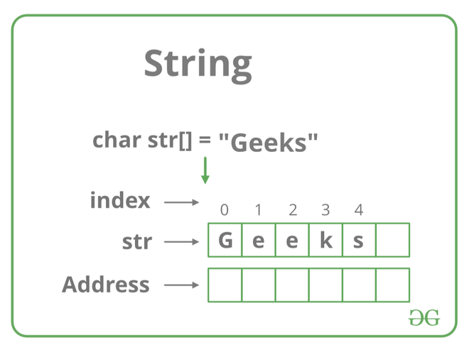

# [Zpracování a parsování textových dat, regulární výrazy, kódování a stringy](https://youtu.be/n74uts2mz6s?si=QRnqaFWBCSdHzCLX)

## O čem mluvit?

- Parsování textu
  - syntaktická analýza textu
  - nejčastější metoda parsování = regex
  - příklady parsovaných dat (logy, uživatelský vstup, soubory..)
- Regulární výrazy (Regex)
  - co to je?
- Kódování
  - speciální znaky - New line, backspace, tab..  
  - ASCII
  - UNICODE
  - UTF
- String
  - co to je?
  - built in metody
  - implemetace stringu
  - proč je immutable?     

## Parsování textu
- = syntaktická analýza textu
- převedení dat z určitého formátu do jiného (použitelnějšího) formátu
- vyhledávání v textu
	- např.: v **C#**: převedení "čísla" na int
		- ```csharp
		  string s = "56"; // Toto "číslo" parsneme na int 
		  int a = int.Parse(s); // Výsledkem bude int s hodnotou 56
		  ```
		- používá se například u kalkulačky, kde uživatel zadá číslo ve formě textu a aby mohlo být číslo použito v příkladu tak je nejdříve potřeba ho převést do intu
	
## Regex
- regulární výraz (**Reg**ular **Ex**pression)
- textový řetězec, který slouží jako vzor pro hledání v jiném textovém řetězci
- <details>
	<summary><a>Regex Cheatsheet</a></summary>
	
</details>

## Kódování
- způsob, jaký upravit data na formu, kterou bude počítač schopný zpracovat
- většinou se ke kódování používají přesně stanovené tabulky a znakové sady
	- *(tzn. že i např. Morseovka je kódovaná)*

#### ASCII
 - používá sedmibitovou tabulku, kde je každému písmenu v anglické abecedě a různým dalším znakům přiřazeno nějaké číslo 
- využívá 0-127 bitů.
- např.: 
	- pro znak **A** je určen kód *41* (v 16 soustavě), a tedy *1000001* v binární
 - <details>
	   <summary><a>ASCII Tabulka</a></summary>
	   
</details>

#### UNICODE
- přiřazuje každému znaku unikátní kód
- podporuje všechny možné jazyky 
	- ...texty, písma včetně cyrilice, arabštiny, čínštiny a mnohem další. 
- má dvou-bytové kódování, čímž má možnost využít dohromady 65536 znaků

#### UTF
- způsob kódování znaků do sekvencí bytů
	- reprezentuje UNICODE znaky pomocí jedno nebo vícebytových sekvencí
- znaky pod 128 jsou kódovány jako ASCII, znaky mezi 128-2047 jsou kódovány dvojicí bytů, 2048-65535 se kódují pomocí trojice bytů a cokoliv nad 65536 se kóduje pomocí více bajtů. Je tedy proměnlivý počet bajtů.
- **UTF-8** 
	- používá proměnnou délku znaku, od 1–4 (6) bajtů (8 – 16 (64) bitů)
- **UTF-16 a UTF-32** 
	- používají právě 16bitová (2 byty), resp. 32bitová slova

#### Huffmanovo kódování
- kód, který převádí jednotlivé symboly původního textu a dělá to co nejúspornějším způsobem  
	- výsledná délka zakódovaného textu je v nějakém smyslu nejmenší možná
###### Příklad
- chceme zakódovat a zkomprimovat zprávu ```AHOJ, JAK SE MAS, KAMARADE?```  Tato zpráva je dlouhá 27 znaků a obsahuje 13 různých symbolů.
- následující tabulka udává jednotlivé znaky, jejich četnost a triviální kódování:
- |Znak|Četnost|Triviální kód|
|----|-------|-------------|
|mezera|4|0000|
|,|2|0001|
|?|1|0010|
|A|6|0011|
|D|1|0100|
|E|2|0101|
|H|1|0110|
|J|2|0111|
|K|2|1000|
|M|2|1001|
|O|1|1010|
|R|1|1011|
|S|2|1100|
- zpráva by se pomocí triviálního kódování zakódovala do následujícího řetězce:
```0011, 0110, 1010, 0111, 0001, 0000, 0111, 0011, 1000, 0000, 1100, 0101, 0000, 1001, 0011, 1100, 0001, 0000, 1000, 0011, 1001, 0011, 1011, 0011, 0100, 0101, 0010```
- výpočtem zjistíme, že výsledná zpráva má velikost **108 bitů**

## String
- řetězec znaků (chars) = pole znaků
	- to nám dovoluje na něj uplatnit funkce použitelné na pole
- string lze také definovat jako posloupnost znaků uložených v navazujících paměťových místech, která je ukončena speciálním znakem zvaným nulový znak **\0**
- string je **neměnný objekt (immutable)**  
	- po vytvoření instance objektu String jej není možné měnit
		- třída sice obsahuje několik metod, které by mohly vypadat, že objekt pozmění, ty ale vytvoří nový objekt a nahradí jím ten starý.

#### Immutable
- **Immutable** 
	- hodnotu Stringu **nemůžeme** měnit po vytvoření
		- nemohu hodnotu přepsat a musím udělat proměnnou znovu
	- proč jsou Stringy immutable:
		- lepší výkon
		- lehčí práce s pamětí
		- thread-safe
	- Java, JavaScript, Lua, Python, ...
- **Mutable**
	- hodnotu Stringu **můžeme** měnit po vytvoření
		- mohu přepsat hodnotu na jinou
	- C, C++, PHP, Ruby, ...



#### Typy
- **Konstatní:**
	- ```javascript
	  //Javascript
	  const PI = 3.141592653589793;
	  PI = 3.14;      // Error
	  PI = PI + 10;   // Error 
- **Staticky alokovaný pamětǒvý prostor pro řetězec:**
	- ```sql
	  --SQL
	  CREATE TABLE test ( desc NVARCHAR(30) )  --Staticky alokovaná velikost textu na 30 znaků
- **Dynamicky alokovaný paměťový prostor pro řetězec:**
	- ```php
	  //PHP
	  $retezec = "Já jsem nějaký řetězec a můžu obsahovat všemožné znaky z ASCII tabulky jako %, =, ' a jiné, ale třeba i z tabulky UNICODE (např. ▒, ☼, ♪). Můžu mít libovolnou velikost a jsem reprezentován dynamicky, podle velikosti paměti.";

#### Built-in Metody (C# / PHP)
- **.Length** / **strlen()**
	- ```csharp
	  // C#
	  string text = "Hello, World!";
	  Console.WriteLine(text.Length); // Prints "13"
	- ```php
	  // PHP
	  $text = "Hello, World!";
	  $length = strlen($text); // Prints "13"
- **.Replace()** / **str_replace()**
	- ```csharp
	  // C#
	  string text = "Hello, World!";
	  string new_text = text.Replace("World", "Prdel"); // "Hello, Prdel!"
	- ```php
	  // PHP
	  $text = "Hello, World!";
	  $newText = str_replace("World", "Prdel", $text); // "Hello, Prdel!"
- **Substring()** / **substr()**
	- ```csharp
	  // C#
	  string str = "Hello World";
	  string substr = str.Substring(6); // "World"
	- ```php
	  // PHP
	  $text = "Hello, World!";
	  $substring = substr($text, 7); // World!
	  echo $substring;  // World!
- **ToUpper()**, **ToLower()** / **strtoupper()**, **strtolower()**
	- ```csharp
	  // C#
	  string str = "Hello";
	  string upperCase = str.ToUpper(); // "HELLO"
	  string lowerCase = str.ToLower(); // "hello"
	- ```php
	  // PHP
	  $text = "Hello, World!";
	  $uppercase = strtoupper($text); // HELLO, WORLD!
	  $lowercase = strtolower($text); // hello, world!
- nebudu psát příklady na všechny, nejsme retardi přeci + tich metod je stovky
- **Contains()**
- **Concat()**
	- spojí dva stringy v jeden
- **Equals()**
- **Split()**
- **Trim()**
	- odstarní všechny whitespace na začátku a konci textu